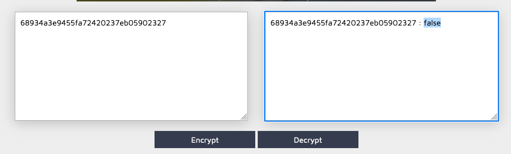

# Write up Admin Cookie

# Exploration

En arrivant sur la page principale de l’application, un cookie nous est attribué:

```bash
Set-Cookie: I_am_admin=68934a3e9455fa72420237eb05902327; expires=Wed, 24-Apr-2024 20:51:16 GMT; Max-Age=3600
```

Ce cookie à l’air d’être lié au fait que nous ayons ou non le rôle **admin**. On peut aussi noter qu’il ne possède pas l’attribut **HttpOnly**, permettant ainsi d’y accéder via du code javascript.

# Exploitation

Le cookie possède une valeur qui est du **md5**. Nous pouvons facilement récupérer cette valeur avec un [outil en ligne](https://md5decrypt.net/), étant donné que c’est une valeur prévisible:



Ainsi, nous n’avons pas le rôle admin, du à la valeur de ce cookie qui est un booléen .

Nous avons essayé de changer cette valeur à **true** avec cette commande bash:

```bash
~ echo -n 'true' | md5
b326b5062b2f0e69046810717534cb09
```

En remplaçant la valeur actuelle du cookie par celle ci, on obtient le flag.

# Remédiation

Pour remédier à cette vulnérabilité, plusieurs mesures sont nécessaires:

- Ne pas utiliser une valeur booléenne ou prédictible dans un cookie de session
- Implémenter un système d’autorisation avec un cookie de session contenant une valeur aléatoire et non prédictible, tel qu’un JWT
- Stocker la correspondance jeton/rôle côté serveur, un jeton **I_am_admin** ne devrait pas être présent côté client

Bien que cela n’ai pas eu d’impact ici, il est aussi important de marquer les cookies avec l’attribut HttpOnly, pour éviter qu’il soit accessible depuis du code Javascript par exemple.