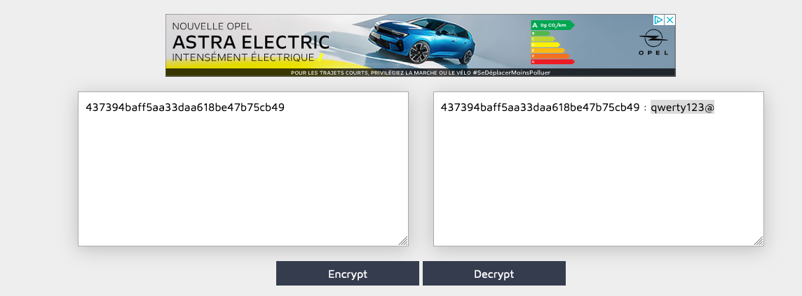

# Write up Admin Panel Login

## Exploration

During our exploration phase, we found the accessible **robots.txt** file.

In this file were mentioned two paths, `/whatever` and `/.hidden`.

Navigating to the `/whatever` directory, the listing of the directory is present, and we can
access a file called `htpasswd`:

```bash
# htpasswd content
root:437394baff5aa33daa618be47b75cb49
```
This seems to be credentials for user 'root'.

We also discovered another common path, `/admin`, with a login page.

## Exploitation

The previously found password is actually an md5 hash. We easily obtained the base password via an
[online tool](https://md5decrypt.net/) since it was a very common password (qwerty123@).



Using the combination 'root:qwerty123@', we were able to log in to the admin panel and obtain the
flag.

## Remediation

The htpasswd file should never be exposed publicly on a web application. It must be stored outside
of the served directory by the server.

We were also able to find it due to the directory listing being activated on the `/whatever` path. It is
generally recommended to always disable it, which is the default for most web servers.

The admin panel should neither been accessible for any users. There are several solutions to this,
like whitelisting authorized IP's to access it, or use a random generated path that can't be guessed.

Lastly, it's essential to establish a strong password policy. We easily decrypted the 'root'
user's password with a simple online tool due to its commonality.

Best practices for password policies include:

- At least 12 characters
- A mix of uppercase and lowercase letters
- Include special characters
- Avoid common or personally related words
- Regularly change them.
