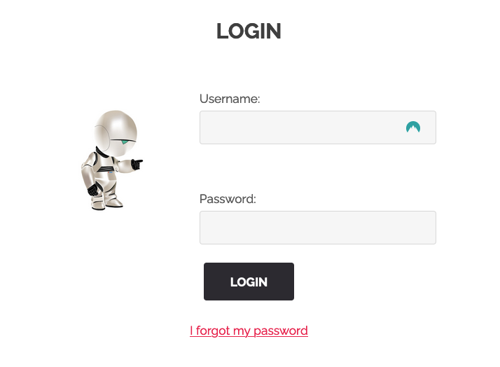
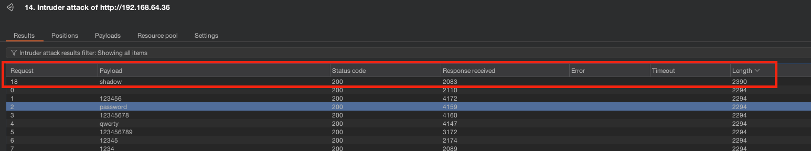

# Write up Password Bruteforce

# Exploration

Nous avons trouvé un panel de login durant notre énumération, disponible sur la page **signin:**

# Exploitation

Nous avons essayé quelques couple username/password par défaut, tel que **admin:admin**, mais cela n’a pas fonctionné.

Nous avons donc essayé un bruteforce sur le login, en utilisant la wordlist **10-million-password-list-top-100.txt**, que nous avons trouvée dans [Seclists](https://github.com/danielmiessler/SecLists), qui regroupe une énorme base de donnée de tout type de wordlist.

Pour ce faire, nous avons utilisé l’Intruder de burp suite:

Une fois terminé, nous pouvons voir qu’une des **Length** de réponse est différentes de autres, avec le payload **shadow**. Cela indique une réponse différente, donc une connexion réussie.

Nous nous sommes donc connecté avec **admin:shadow** pour récupérer le flag. A noter que n’importe quel nom d’utilisateur fonctionnait pour avoir ce flag.

# Remédiation

Le bruteforce est une attaque couramment utilisée, qui peut avoir de grosses conséquences. Un utilisateur malveillant ayant accès à un compte d’administrateur d’une plateforme pourrait causer avoir des conséquences en terme d’intégrité, de confidentialité ou même de disponibilité, et ainsi causer des dommages à l’image de l’entreprise.

Pour s’en prémunir, voici quelques recommendations:

- Limiter les tentatives de connexion, que ce soit par utilisateur ou par adresse IP sur une période de temps donnée
- Ajouter un double facteur d’authentification
- Introduire un délai exponentiel entre chaque tentative de connexion infructueuse, ralentissant considérablement une attaque de bruteforce
- Exiger l’utilisation de mot de passe robuste, incluant au moins 12 caractères, ainsi qu’une combinaison de lettre majuscule et minuscule, des chiffres et caractères spéciaux.