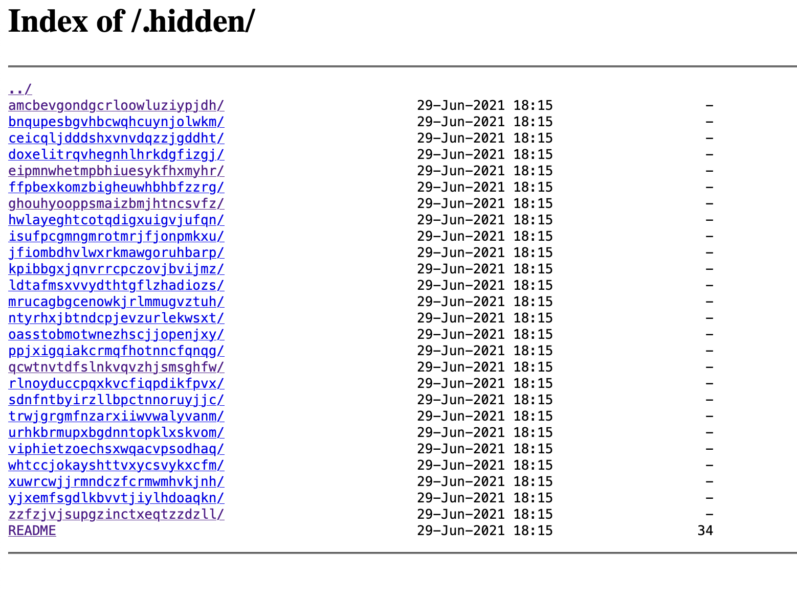

# Write up Directory Listing

# Exploration

Pendant notre phase d’exploration, nous avons trouvé le fichier **robots.txt** d’accessible.

Dans ce fichier étaient mentionnées 2 chemins, **/whatever**  et **/.hidden**.

En naviguant sur **/.hidden**, nous sommes tombé sur un **directory listing**:



Il contient un ensemble de sous dossiers, avec dans chaque page un fichier **README**.

# Exploitation

Le contenu des fichiers **README** semble indiquer que ce que nous cherchons n’est jamais au bon endroit.

Nous avons donc écrit un petit script python pour naviguer à travers tous ces chemins, avec pour but de lire tout les fichiers **README** et de s’arrêter une fois découvert celui mentionnant notre flag, avec le chemin ou il a été découvert:

```jsx
~ python3 script.py
[... TRUNCATED DATA ...]
http://192.168.64.36/.hidden/whtccjokayshttvxycsvykxcfm/igeemtxnvexvxezqwntmzjltkt/lmpanswobhwcozdqixbowvbrhw/README
Hey, here is your flag : d5eec3ec36cf80dce44a896f961c1831a05526ec215693c8f2c39543497d4466
[... TRUNCATED DATA ...]
```

# Remédiation

Le directory listing permet de lister tout les fichiers présents sur un chemin donné quand il n’y a pas d’index de présent (.html, .php etc), ou en fonction de la configuration du serveur web.

Il peut être utile dans certains cas, mais c’est généralement recommandé de le désactiver, principalement pour des questions de sécurité. Il peut divulguer des infos sensibles, comme des noms de fichiers, des versions de logiciels etc..

Bien que cela ne représente pas de vulnérabilité en soit, cela peut permettre à une personne malveillante de mieux comprendre sa cible et d’étendre sa surface d’attaque.