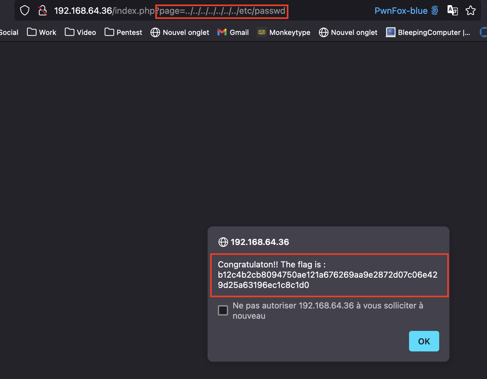

# Write up Local File Inclusion

# Exploration

Durant notre naviguation à travers le site, nous avons remarqué que les pages était chargées à partir du paramètre **page**, à partir de **index.php**:


# Exploitation

Nous avons essayé différents payloads de LFI (Local File Inclusion).

Le principe de ces payloads est assez simple. Assumons de se dire que le code de la page **index.php** contient ceci:

```php
<?php
		$allowedDir = '/chemin/de/nos/pages/';
    $file = $_GET['page'];
    $file = $allowedDir . $file
    include($file);
?>
```

Si nous effectuons une requête avec comme paramètre **survey.php**, le serveur renverra donc la page **/chemin/de/nos/pages/survey.php**.

Par contre, si à la place de **survey.php**, nous demandons le fichier **../../../../etc/passwd**, alors le serveur nous renverra cette fois le fichier **/chemin/de/nos/pages/../../../../etc/passwd**, qui correspond finalement au fichier **/etc/passwd**, qui ne devrait pas être accessible.

Nous avons donc effectué cette requête et obtenu le flag:



# Remédiation

Les vulnérabilités de Local File Inclusion peuvent avoir des conséquences critiques pour un serveur, pouvant mener dans le pire des cas à une exécution de commande à distance, mais aussi à la lecture du code source, accès à des fichiers contenant des informations sensibles telle que des mots de passes, fichiers de configuration etc..

Il est donc très important de s’en prémunir.

En fonction des besoins il n’est pas toujours possible de se protéger de la même manière, mais voici quelques recommandations générales:

- Validation de l’entrée utilisateur, par exemple en n’acceptant que des caractères alphanumériques pour le nom du fichier demandé
- Mise en place d’une whitelist de fichier auquel les clients peuvent accéder
- Limiter l’accès des utilisateurs au seul dossier utile pour le serveur web, par exemple **/var/www/html**
- Résoudre les chemins avant de les utiliser, il est possible d’utiliser la fonction `realpath` en PHP