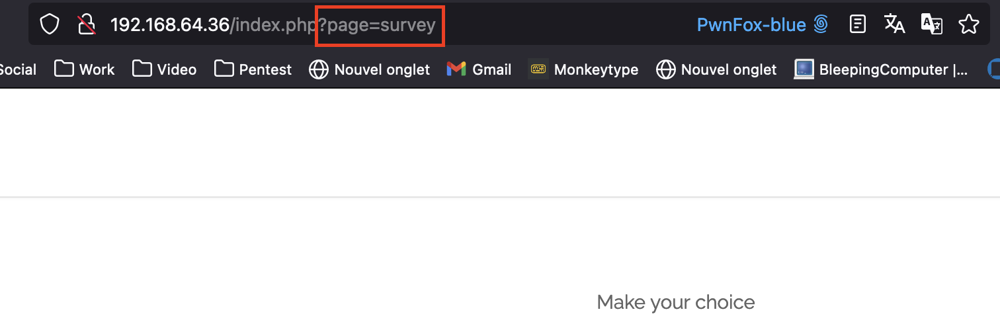

# Write up Local File Inclusion

## Exploration

During our navigation through the site, we noticed that pages were being loaded from the **page** parameter in `index.php`:



## Exploitation

We tried various Local File Inclusion (LFI) payloads.

The principle of these payloads is simple. Let's assume that the code of page `index.php` work this way:

```php
<?php
$allowedDir = '/path/to/our/pages/';
$file = $_GET['page'];
$file = $allowedDir . $file;
include($file);
?>
```

If we make a request with the parameter `survey.php`, the server will return the page `/path/to/our/pages/survey.php`. However, if instead of `survey.php`, we request the file `../../../etc/passwd`, then
the server will give us this time the file `/path/to/our/pages/../../../etc/passwd`, which actually corresponds to the file `/etc/passwd`, which should not be accessible.

We made this request and obtained the flag:


## Remediation

Local File Inclusion vulnerabilities can have critical consequences for a server, leading in the worst case to remote command execution, but also to file reading, source code access, sensitive information
leakage such as passwords, configuration files etc...

Therefore, it is very important to protect against them.

Depending on the needs, it may not always be possible to protect in the same way, but here are some general recommendations:

- User input validation, for example by only accepting alphanumeric characters for the requested file name
- Implementing a whitelist of files that clients can access
- Limiting user access to only the necessary directory for the web server, such as `/var/www/html`
- Resolve paths before using them, it is possible to use the `realpath()` function in PHP.
