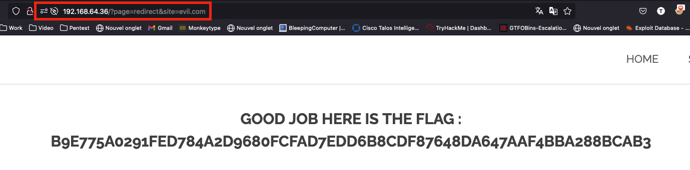

# Write up Open Redirect

## Exploration

On the homepage of the website, at the bottom, there are three logos referring to Facebook, Twitter, and Instagram. If we click on them, we are redirected to the corresponding page:

## Exploitation

Upon examining the link that redirects us, we notice that a page named `redirect` is being loaded with a parameter corresponding to the redirection. In the image above, you can see `facebook` as the value.

By modifying this value, we obtain the flag:

## Remediation

An open redirect is a vulnerability that allows an attacker to redirect a victim to a website under their control without the victim's knowledge. The consequences can be severe:

- Phishing: The attacker redirects the victim to a phishing site to steal credentials
- Cookie theft if passed in GET parameters
- XSS: exploiting the vulnerability to inject JavaScript code onto the page
- DDoS: using it for other attacks, such as a denial of service

To mitigate this vulnerability, several steps are necessary:

- Whitelist: Implement a whitelist of authorized domains for redirection
- User input validation, to ensure the URL is valid
- Do not pass identification tokens in GET parameters
