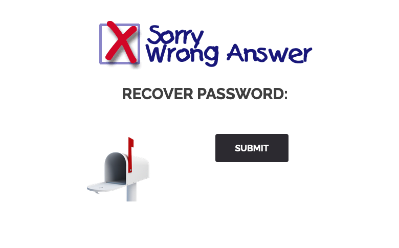
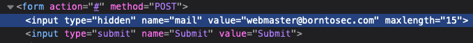
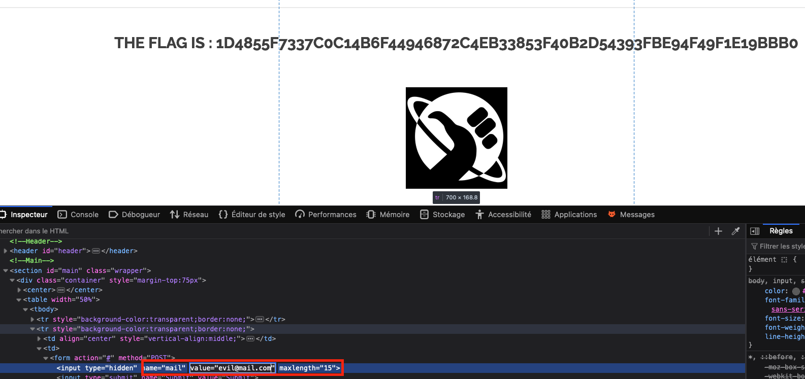

# Write up Reset Password Account Takeover

# Exploration

Sur la page de login (**signin**), il y a une fonctionnalité de reset de password. En naviguant dessus, il n’y a qu’un seul bouton, **Submit**. En cliquant dessus, nous obtenons une réponse, **Wrong Answer:**

# Exploitation

En observant le code source de la page, on remarque qu’une valeur est **hidden**, et contient le mail à qui sera renvoyé la réinitialisation de mot de passe:

Ici, le mail sera envoyé à **webmaster@borntosec.com**.

Si l’on modifie le code HTML et que l’on renvoie le mail, nous obtenons le flag:

# Remédiation

Un account takeover par reset de mot de passe est une vulnérabilité courant sur les applications web. Cela permet à un acteur malveillant de renseigner un mail qu’il contrôle pour récupérer le mot de passe d’un utilisateur légitime, et ainsi accéder à son compte.

Dans le cas présent, nous pourrions prendre le contrôle du compte **webmaster**, qui pourrait avoir de grave conséquences pour les propriétaires du site.

Pour remédier à cette vulnérabilité, voici quelques recommandation:

- Vérifier que l’utilisateur est légitime à faire une demande de reset de mot de passe. Dans le cas présent, notre session ne devrait pas avoir la possibilité de faire une demande de mot de passe pour l’utilisateur webmaster avec un email différent
- Dans la situation où il ne peut y avoir qu’un seul utilisateur (webmaster) d’enregistré, ne pas permettre de changer le mail côté client, et toujours l’envoyer au même mail