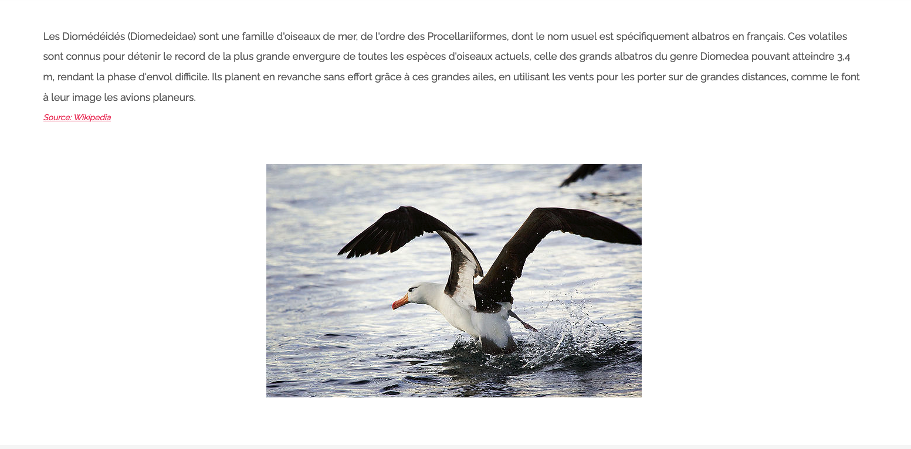
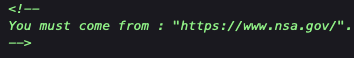
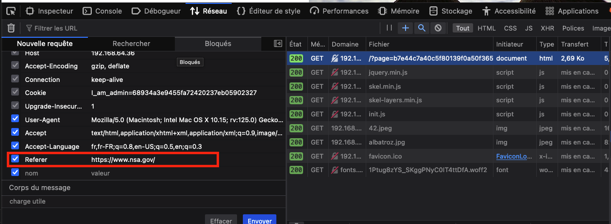
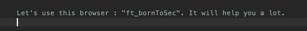

# Write up Source code comments

# Exploration

Navigating through the site, if we click on the logo [© BornToSec](http://192.168.64.36/?page=b7e44c7a40c5f80139f0a50f3650fb2bd8d00b0d24667c4c2ca32c88e13b758f) at the bottom of the page, we are redirected
to another page:

At first glance, there doesn't seem to be any vulnerability to exploit.

# Exploitation

Upon inspecting the source code of this page, we came across a somewhat explicit comment:

Through deduction, we sent a new request to this page but with the added header HTTP "**Referer: https://www.nsa.gov/**"

Upon sending it, a second comment appeared:

Once again, with some thought, we deduced that it referred to the User-Agent header. We changed it to the value **ft\_bornToSec** and thus obtained the flag.

# Remediation

Comments in source code are often left during the development of an application. These comments may contain a great deal of interesting information for an attacker, even going so far as to include
administrator passwords.

To mitigate this vulnerability, simply ensure that comments remain only in the source code of an application during production.
