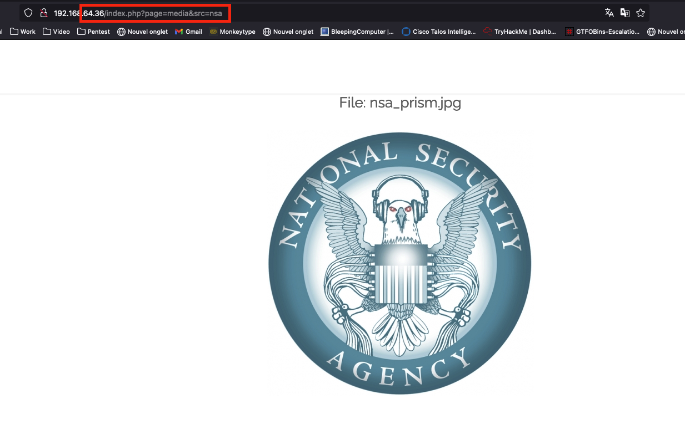
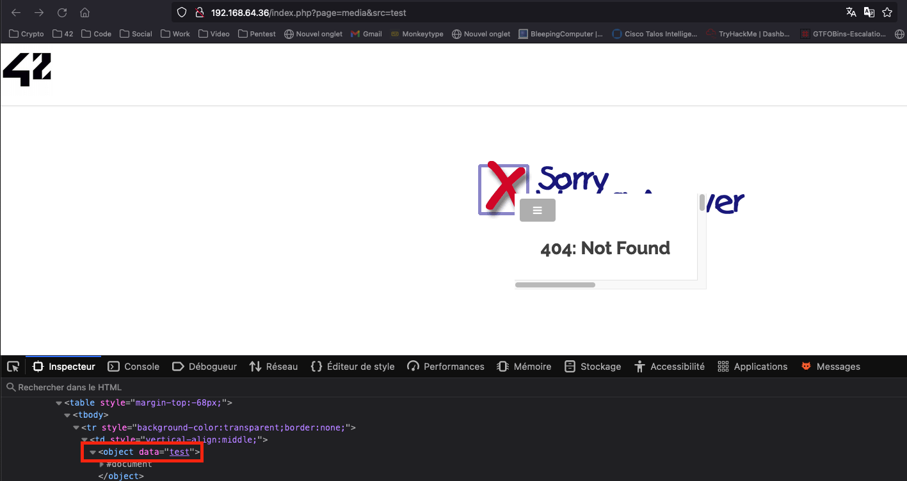
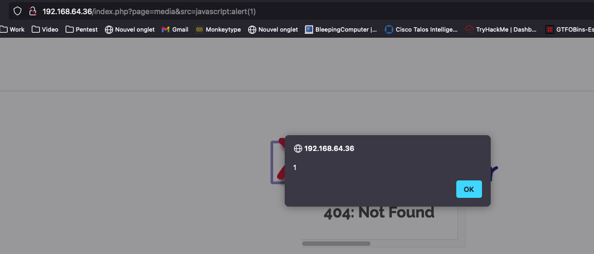
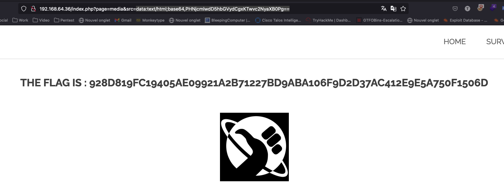

# Write up Reflected XSS Media

# Exploration

Durant notre exploration, nous nous sommes rendu compte qu’il était possible de cliquer sur une image, qui nous redirigeait vers une page nous montrant à nouveau cette image:



# Exploitation

En modifiant la source de l’url par une valeur random, **test**, une page d’erreur est apparue, est notre valeur était reflétée dans une balise HTML **<object>:**



Nous avons donc essayé de rentrer plusieurs payloads XSS dans le but d’obtenir une execution de code javascript, et après plusieurs essais, nous l’avons obtenu:



Malheureusement, nous n’avons pas eu le flag. Nous avons donc continué nos recherches.

Nous avons creusé du côté de la balise **object**, et nous sommes tombés [ici](https://security.stackexchange.com/questions/258306/how-is-object-tag-data-uri-xss-actually-xss), qui nous à ensuite mené [ici](https://developer.mozilla.org/en-US/docs/Web/HTTP/Basics_of_HTTP/Data_URLs). 

D’après les explications, nous pouvons charger de la data directement encodée en base64, en suivant ce payload:

**data:[<mediatype>][;base64],<data>** 

Etant donné que notre but est d’executer du code javascript, nous avons choisi d’utiliser le mediatype **text/html**

En ce qui concerne la valeur, nous avons simplement utilisé cette commande:

```php
echo -n '<script>alert(1)</script>' | base64
```

Le payload final est donc **data:text/html;base64,PHNjcmlwdD5hbGVydCgxKTwvc2NyaXB0Pg==**

Nous l’avons rentré dans le paramètre **src**, et nous avons obtenu le flag:



# Remédiation

Nous sommes ici face à une Reflected XSS via le paramètre GET. Un acteur malveillant pourrait transmettre cette url à une victime pour lui faire executer du code javascript sur son navigateur. Les conséquences peuvent être un vol de cookie, vol de compte etc..

Pour remédier à cette vulnérabilité, voici quelques précautions à suivre:

- Validation de l’input utilisateur, et encoder ou supprimer les caractères spéciaux. Des librairies sont spécialement conçues pour ca
- Encoder les sorties des caractères spéciaux en HTML, surtout quand l’input de l’utilisateur est reflété
- Configurer des des en têtes de sécurités appropriés, tels que les CSP (Content Security Policy) pour atténuer l’impact XSS