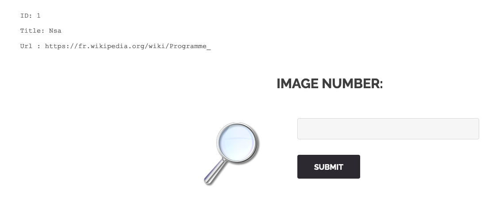
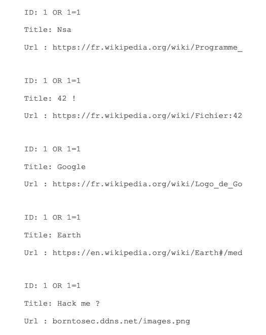
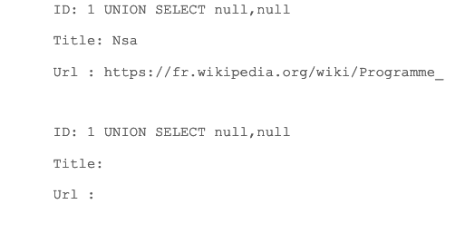
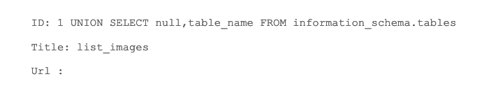
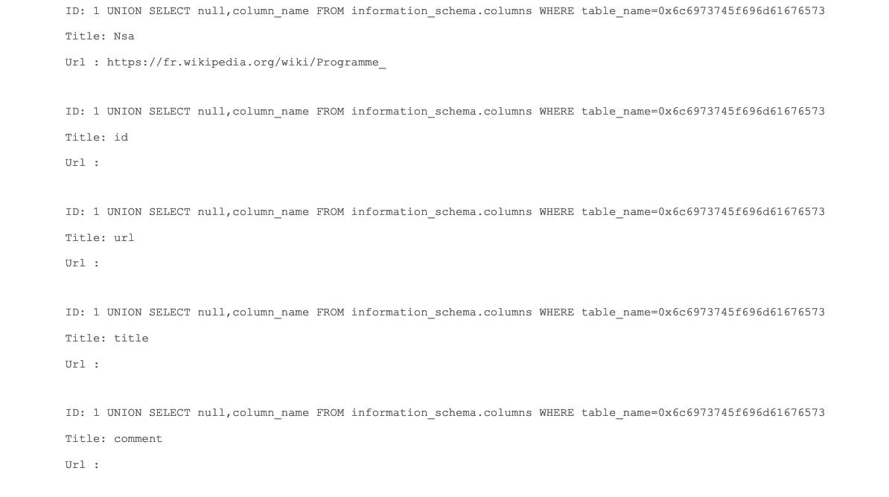
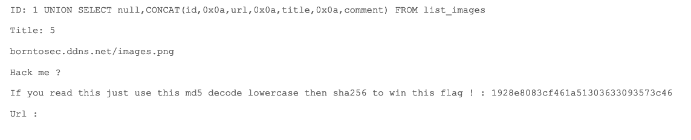
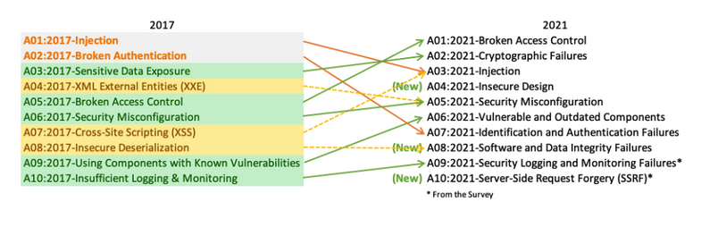

# Write up SQL Injection page searchimg

# Exploration

Durant notre exploration de l’application web, nous sommes tombés sur une fonctionnalité pour retrouver des informations sur les images à partir de leur ID:



# Exploitation

Etant donné que cette fonctionnalité permet de retrouver des images, nous avons déduit qu’elle avait une interaction avec la base de donnée et était donc potentiellement vulnérable aux injections SQL. Pour s’en convaincre, nous avons utilisé ce payload:

**1 OR 1=1**

Cela nous à retourné toutes les images:



A la différence de l’autre injection SQL présente sur l’application, les erreurs ne nous sont pas retournées, mais nous faisons toujours face à une injection UNION based. Cela confirme aussi qu’il y a deux champs de renvoyés, correspondant à **Title** et **URL**:



On peut imaginer que la requête SQL de base ressemble à ca:

```php
#Le champ images? correspond au nom de tbale que nous devons trouver
SELECT ?,? FROM images? WHERE id=<notre_payload>;
```

En utilisant ce payload:

**1 UNION SELECT null,table_name FROM information_schema.tables**

Nous avons pu récupérer le nom de la table que nous cherchions:



Nous avons ensuite récupéré le nom des colonnes en utilisant ce payload:

**1 UNION SELECT null,column_name FROM information_schema.columns WHERE table_name=0x6c6973745f696d61676573**

Nous avons du encoder le nom de la table en hexa, il semble que cela ne fonctionnait pas en ajoutant directement le nom avec des quotes. Nous avons utilisé cette commande:

```php
~ echo -n 'list_images' | xxd
00000000: 6c69 7374 5f69 6d61 6765 73              list_images
```

Et nous avons obtenu:



Nous avons ensuite pu récupérer le contenu de ces colonnes en les concaténants:

**1 UNION SELECT null,CONCAT(id,0x0a,url,0x0a,title,0x0a,comment) FROM list_images**



En décodant la valeur md5, nous avons obtenu le mot **albatroz**.

Nous l’avons ensuite converti en sha256 pour avoir le flag:

```php
➜  ~ echo -n "albatroz" | openssl dgst -sha256
SHA2-256(stdin)= f2a29020ef3132e01dd61df97fd33ec8d7fcd1388cc9601e7db691d17d4d6188
```

# Remédiation

Les injections SQL sont des vulnérabilités encore très fréquentes sur les applications web si l’on se refère au [top 10 OWASP](https://owasp.org/Top10/fr/). En 2021, les injections (tout types confondus) se classent encore en 3ème place:



Cela mène souvent à de terribles conséquences pour les sites vulnérables, incluant:

- Altération ou suppression des données présentes
- Élévation de privilèges
- Leak d’information
- Éxecution de commande à distance

Pour s’en protéger, voici plusieurs étapes à suivre:

- Utilisation d’ORM permettant d’utiliser des requêtes préparées
- Validation de l’input de l’utilisateur
- Ne jamais utiliser de la donnée contrôlable par l’utilisateur dans des requêtes SQL
- Suivre le principe du moindre privilège
- Chiffrer les données sensibles en base de donnée