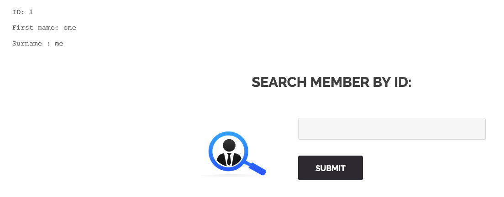
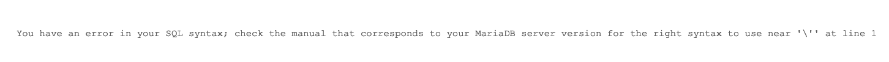
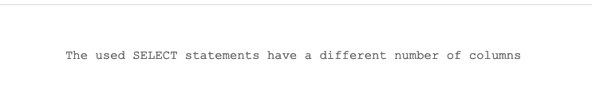
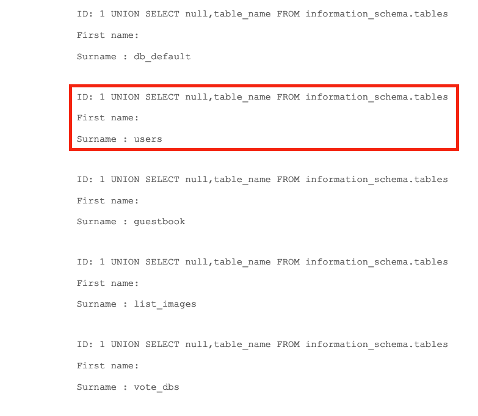
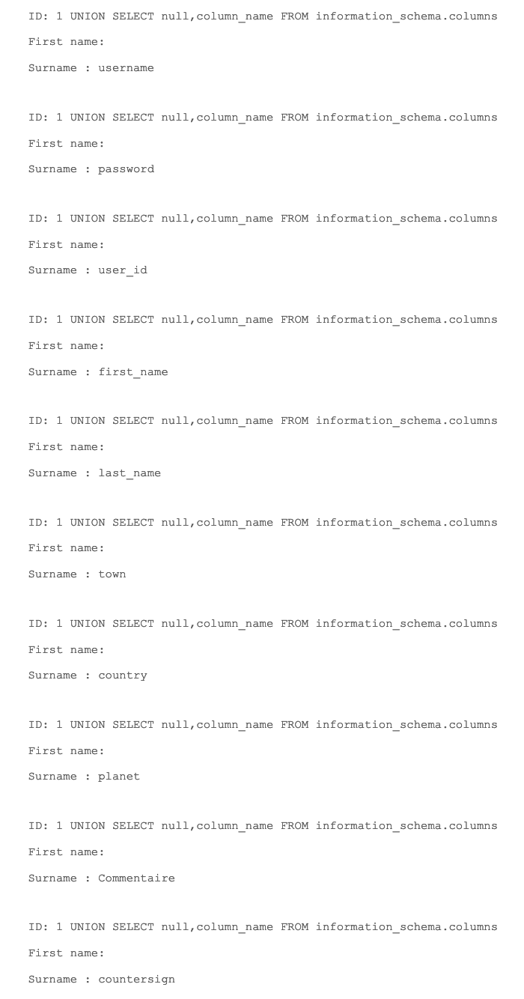
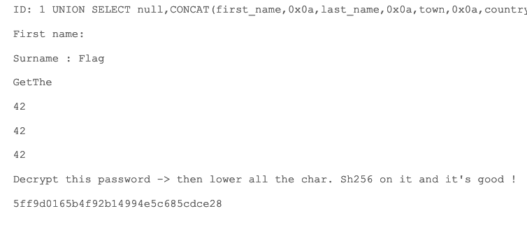
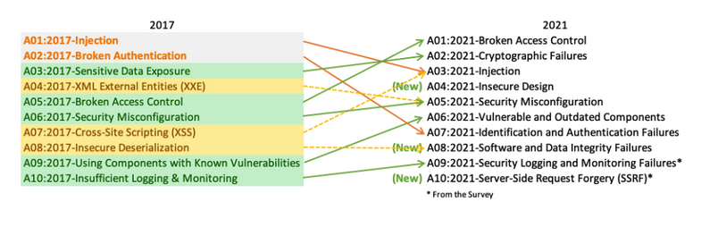

# Write up SQL Injection page member

## Exploration

During our exploration of the web application, we came across a feature to retrieve information about members based on their ID:



## Exploitation

Given that this functionality allows finding users, we deduced that it interacts with the database and could be potentially vulnerable to SQL injection. To confirm, a simple quote as ID can trigger an
error:



Initially, our input is not verified before making the database query. Our objective is to try and recover the database content from this SQL injection.

We believe that the base SQL query looks like:

```php
# The first ? corresponds to the number of columns returned that we need to determine
# We assume there are 2, for first name and last name

SELECT ? FROM users? WHERE id=<our_payload>;
```

First, we'll ensure the number of columns returned using an injection with UNION:

**1 UNION SELECT null,null**

This works. To confirm, we remove a null and run the query again, we get an SQL error:



To understand the payload, it's essential to comprehend how UNION work in SQL functions. It allows combining other data with a query but must return the same number of data as the first query. Data types should
also correspond, making **null** an ideal candidate.

The following payload will allow us to recover all table names from the database:

**1 UNION SELECT null,table_name FROM information_schema.tables**

We get a lot of output, but let's confirm that the 'users' table exists:



Next, we will obtain the column names for this table:

**1 UNION SELECT null,column_name FROM information_schema.columns**

We get a lot of output again, but we find a set of columns that seem related to users:



So we will recover all these values by concatenating them:

**1 UNION SELECT null,CONCAT(first_name, 0x0a, last_name, 0x0a, town, 0x0a, country, 0x0a, planet, 0x0a, Commentaire, 0x0a, countersign) FROM users**

And we obtain what we were looking for:



We decode the value **5ff9d0165b4f92b14994e5c685cdce28** using this [online decryptor](https://md5decrypt.net/), which gives us the value **FortyTwo**.

Following the suggestions given, we convert it to lowercase and calculate its SHA-256 hash:

```php
echo -n "fortytwo" | openssl dgst -sha256
SHA2-256(stdin)= 10a16d834f9b1e4068b25c4c46fe0284e99e44dceaf08098fc83925ba6310ff5
```

## Remediation

SQL injections are still among the most common vulnerabilities for web applications according to the [OWASP Top 10](https://owasp.org/Top10/fr/). In 2021, SQL injections (of all types) ranked as the third
most common issue:



This can lead to severe consequences for vulnerable websites, including:

- Data manipulation or deletion
- Privilege escalation
- Information leaks
- Remote code execution

To protect against SQL injection, follow these steps:

1. Use an ORM that supports prepared statements.
2. Validate user input.
3. Never use user-controllable data in SQL queries.
4. Follow the principle of least privilege.
5. Encrypt sensitive database data.
