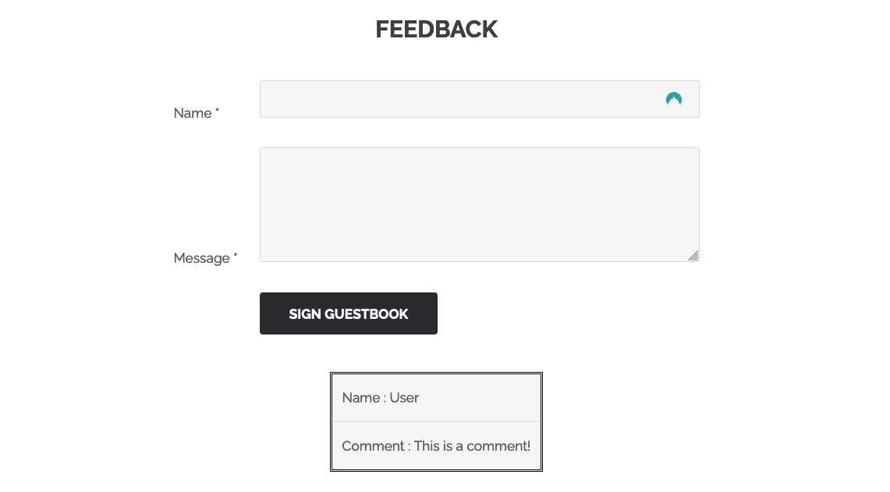
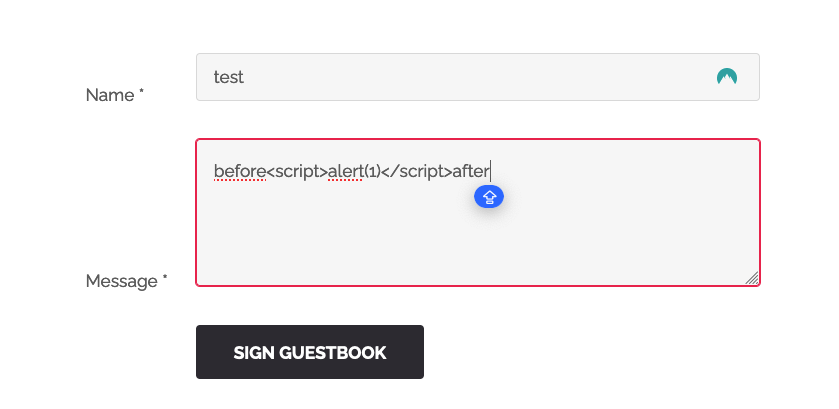
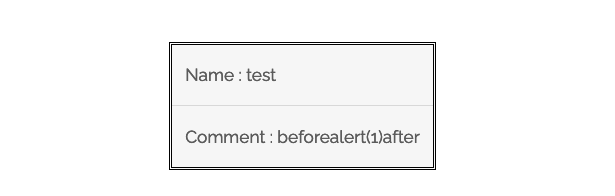
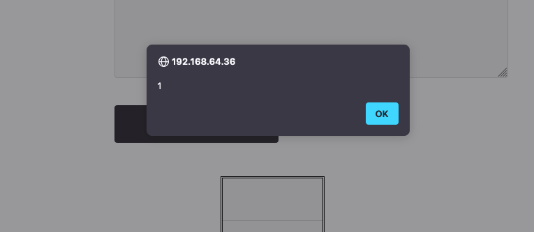
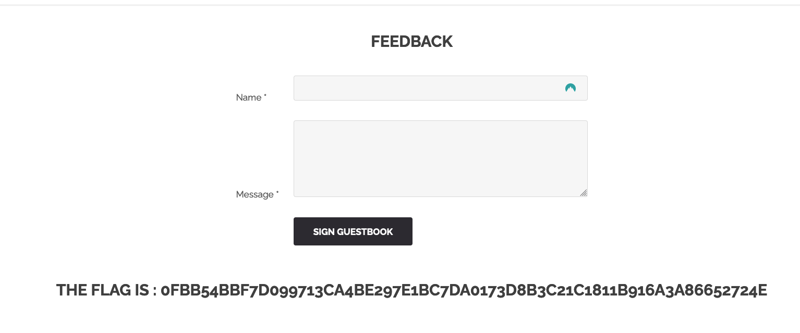

# Write up Reflected XSS Media

## Exploration

During our exploration, we came across a feedback form where we could leave a comment which was then reflected on this page:

## Exploitation

We quickly thought of the possibility of Reflected XSS, as this type of functionality is often vulnerable.

So we entered common XSS payloads, and noticed that our `<script>` tags were being stripped from our comments:

However, an XSS payload did work in the name field with the following:

``

After using many payloads (6000, thanks Intruder), and several odd tests, it seems that simply writing `script` as a comment gave us the flag. Why not.

And that's how we got it:

## Remédiation

Here we are dealing with a Stored XSS. The impact of such vulnerability can be significant, as the injection is stored in the database and executed in each user's browser where it is exposed.

The consequences can be numerous:

- Session cookie theft
- Privilege escalation
- Defacing
- etc...

To remediate this vulnerability, here are some precautions to take:

- User input validation and encode or remove special characters. Libraries are specifically designed for this
- Encode output special characters in HTML, especially when reflecting user input
- Configure appropriate headers such as CSP (Content Security Policy) to mitigate XSS impact
